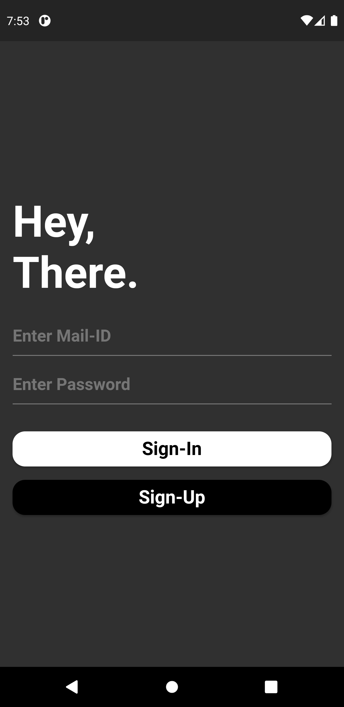
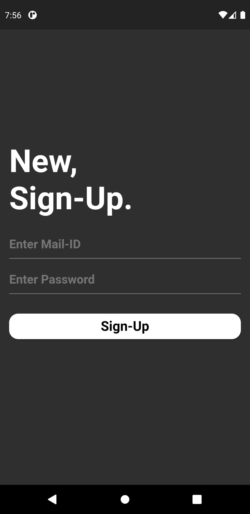
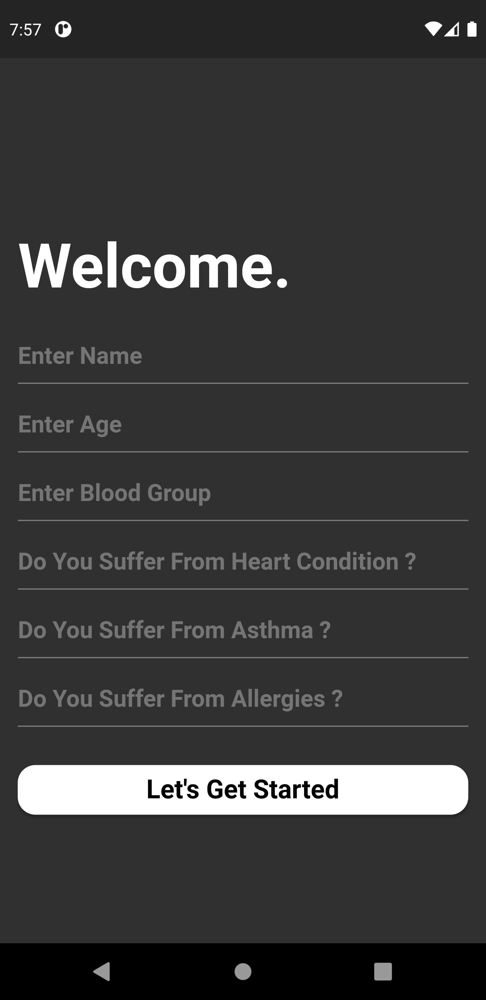

## The Patrollers App

The Patrollers is a systme that we have come up with to suit the new requirements for a safe social gathering. It uses a technological system to ensure that the people can continue to enjoy a social life similar to one they had before the pandemic struck, while making it as safe as possible by emphasizing on the concepts of social distancing and the importance of wearing masks.

## Packages Used 

The Following Dart And Flutter Packages Has Been Used In The Project.
```dart
import 'package:firebase_auth/firebase_auth.dart';
import 'package:firebase_core/firebase_core.dart';
import 'package:cloud_firestore/cloud_firestore.dart';
import 'package:google_maps_flutter_heatmap/google_maps_flutter_heatmap.dart';
```

## Details

In controlled environments, we use CCTV deployed crowd counting to keep check of the number of heads in the area covered by the cameras. Controlled environments include places with potential crowding which could pose a threat to the spread of the virus, or any disease of sorts, like Malls and Airports. A threshold is set based on the area which inspects the population density, that is, it counts the number of people in the covered area. If the threshold for the number of people in the covered area is crossed, an automated announcement will be made through pre-installed speakers in the area to remind the crowd to maintain distance from each other and to declutter the place. 

An accompanying mobile application will be designed to ensure further precautionary measures. This app will be made mandatory to download when entering the Mall or Airport, in which we will already have installed the aforementioned technology for crowd decluttering. The app starts by requesting the user to register some personal information for identification. Along with this, it collects some basic emergency health information such as a medical history, if available. Some of the compulsory health information that needs to be entered includes history of allergies to substances and medication, presence of respiratory or heart conditions and blood group. 
In addition to this, it will request for permission to access the device's location. Using this, it displays present and potential crowd zones through a heat map (with red zones) of the area to help avoid cluttering in the vicinity. It will also produce and display the probable safest path that can be used to reach your destination within the environment.

This function of location permission additionally serves to help the individual if a health related emergency arises when in the vicinity of the application's function, in which case the pre-recorded medical records and health information will come to use, providing a quicker and safer solution for the issue.
An addition to the already optimal system will be the detection of whether an individual is wearing a mask in the locale.

The specialty of The Patrollers is that it is not only applicable in the safety during the current conditions with covid-19, but also for future safety due to its numerous emergency related and mapping features. It is flexible to the map of any area it is subjected to, provided the representatives, or the authorities of the locale installs the complete blueprints of its area, ensuring optimal use of its features.

## Getting Started

* Get an API key at <https://cloud.google.com/maps-platform/>.

* Enable Google Map SDK for each platform.
  * Go to [Google Developers Console](https://console.cloud.google.com/).
  * Choose the project that you want to enable Google Maps on.
  * Select the navigation menu and then select "Google Maps".
  * Select "APIs" under the Google Maps menu.
  * To enable Google Maps for Android, select "Maps SDK for Android" in the "Additional APIs" section, then select "ENABLE".
  * To enable Google Maps for iOS, select "Maps SDK for iOS" in the "Additional APIs" section, then select "ENABLE".
  * Make sure the APIs you enabled are under the "Enabled APIs" section.

* You can also find detailed steps to get start with Google Maps Platform [here](https://developers.google.com/maps/gmp-get-started).

## Android

Specify your API key in the application manifest `android/app/src/main/AndroidManifest.xml`:

```xml
<manifest ...
  <application ...
    <meta-data android:name="com.google.android.geo.API_KEY"
               android:value="YOUR KEY HERE"/>
```

## Images








## Getting Started

This project is a starting point for a Flutter application.

A few resources to get you started if this is your first Flutter project:

- [Lab: Write your first Flutter app](https://flutter.dev/docs/get-started/codelab)
- [Cookbook: Useful Flutter samples](https://flutter.dev/docs/cookbook)

For help getting started with Flutter, view our
[online documentation](https://flutter.dev/docs), which offers tutorials,
samples, guidance on mobile development, and a full API reference.
